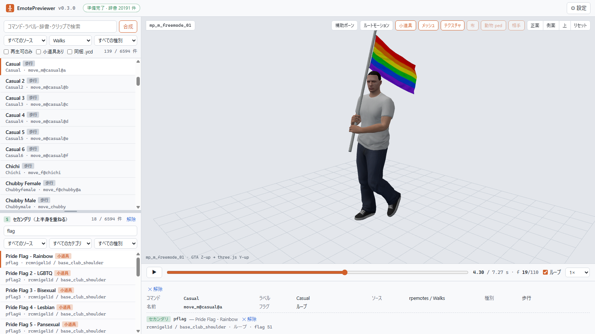
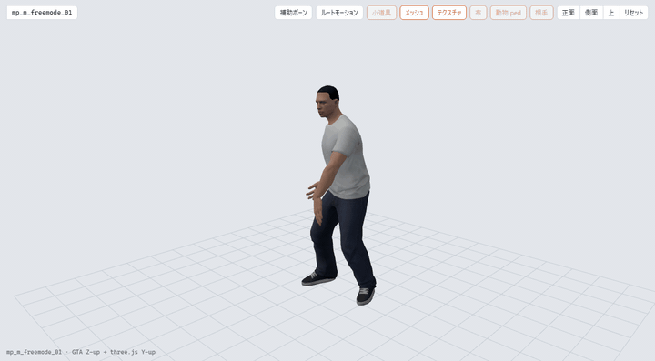
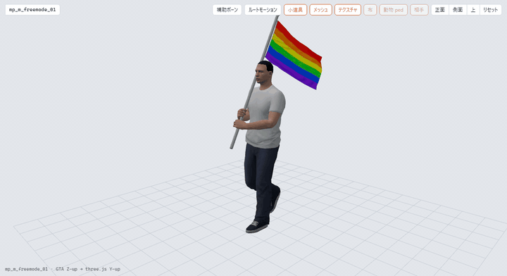
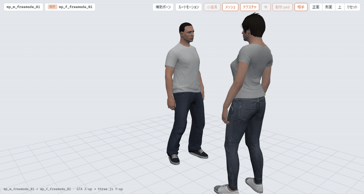
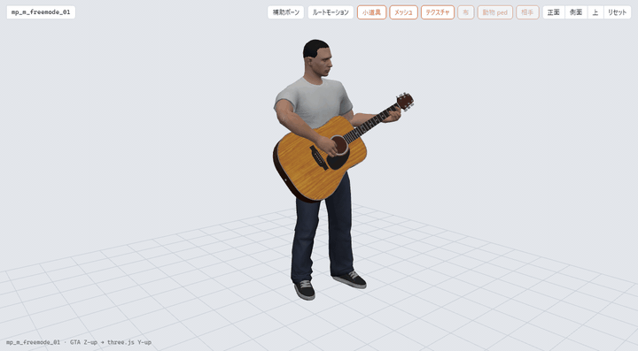

# EmotePreviewer

**FiveM のエモートを、自分の GTA V から再生して一覧・検索・プレビューする Windows ツール。**

[English](README.md) | 日本語

EmotePreviewer は [rpemotes-reborn](https://github.com/alberttheprince/rpemotes-reborn) と [scully_emotemenu](https://github.com/Scullyy/scully_emotemenu) のエモート定義を読み、それぞれのアニメーションを手元の GTA V から探し出して、ブラウザの 3D ビューアで再生します。サーバーに入る必要も、ロード待ちもありません。6,000 件超の一覧からエモートを選べば 1 秒後には動いています。小道具付きで、好きな ped で、2 人で行うエモートなら相手も一緒に。単一の Windows 実行ファイルで、インストールは不要です。

<p align="center">
  
</p>

## 機能

| | |
|---|---|
| **一覧と検索** | リソースのエモートを全部 1 つの一覧に。<br>コマンド・ラベル・辞書・クリップ名で即時に検索。<br>リソース、カテゴリ、種別、「小道具あり」「再生可のみ」で絞り込み |
| **本物の再生** | ゲームの `.ycd` をそのままデコード。<br>再生・一時停止・スクラブ・ループ・速度変更・ルートモーションの切り替え |
| **ped とテクスチャ** | ゲーム内の 1,100 体（freemode、一般市民、職業、ストーリー登場人物、動物）をディフューズテクスチャ付きで。<br>動きだけ見たいときは棒人間で |
| **小道具** | 傘、ギター、電話、カップ、看板などを、定義どおりのボーンにテクスチャ付きで表示。<br>物理付きの小道具も、リソース同梱のモデルも読む |
| **共有エモート** | ハグ、握手、おんぶ、CPR、犬を抱く。<br>相手側のエモートも読み取り、定義どおりの配置（向かい合う／相手の骨にぶら下がる）で 2 体同時に再生。<br>相手の ped は設定で選べる |
| **重ね合わせ** | ゲームのエモートには「全身」のものと「上半身だけ」のもの（歩きながら手を振る、旗を掲げる …）があり、上半身だけのエモートは全身のエモートの上に重なって再生される。<br>ビューアも同じ規則で、全身のエモートを選んでから「合成」で上半身のエモートを選ぶと、2 つが重なった姿になる |
| **動物エモート** | 対応する動物（ロットワイラー、パグ、猫、コヨーテ …）に自動で切り替わる |
| **歩行スタイル** | ゲームのクリップセット表を引いて歩行サイクルを再生。<br>シナリオと表情は再生できない理由付きで一覧に出る |
| **辞書内のクリップ** | あるエモートの辞書にある他のクリップも、ビューアを離れずに選んで見られる |
| **リソースの取得** | rpemotes-reborn / scully_emotemenu を設定画面から GitHub 経由で取得・更新。<br>手元のフォルダも追加できる |
| **編集しながら使える** | フォルダリソースは監視されていて、追加・上書きした `.ycd` や Lua ファイルは少し後に反映される。<br>表示中のクリップは再生位置を保ったまま差し替わる。<br>設定画面の「再スキャン」で手動でも |

<p align="center">
  
  
</p>

<p align="center">
  
  
</p>

## 前提

- Windows 10 / 11（x64）とブラウザ（Edge、Chrome …）。
- **GTA V PC 版の Legacy 版**（Steam、Rockstar Games Launcher、Epic）。アニメーション、スケルトン、メッシュ、テクスチャの読み出し元です。GTA V Enhanced は対象外。ゲームが無くても一覧と検索は使えますが、再生はできません。
- **鍵ファイル 4 つ。** 自分のゲームから [EmotePreviewer Key Tool](https://github.com/Acc-Off/EmotePreviewerKeyTool) で作ります（下の手順 1）。アーカイブは暗号化されており、EmotePreviewer は鍵材料を含みません。
- エモートリソース本体。設定画面から rpemotes-reborn と scully_emotemenu を GitHub から取得できます。手元にあるコピーはフォルダとして使えます。

## はじめかた

1. **鍵ファイルを作る。** [Key Tool の Releases](https://github.com/Acc-Off/EmotePreviewerKeyTool/releases) から `EmotePreviewerKeyTool-<version>-win-x64.exe` をダウンロードしてダブルクリックします。`GTA5.exe` から鍵を読み、EmotePreviewer が参照する `%LOCALAPPDATA%\EmotePreviewer\keys` に書き出します。一度だけで済みます。
2. **EmotePreviewer をダウンロードする。** [Releases](https://github.com/Acc-Off/EmotePreviewer/releases) から `EmotePreviewer-<version>-win-x64.exe` を取得して実行します。コード署名していないため Windows SmartScreen が一度確認してくることがあります（「詳細情報」→「実行」）。コンソールウィンドウが開き、ブラウザで `http://127.0.0.1:20300/` が開きます。
   - `…-slim.exe` はずっと小さいですが、.NET 10 の **Desktop Runtime** と **ASP.NET Core Runtime**（x64、https://dotnet.microsoft.com/download/dotnet/10.0）が必要です。すでに入っている場合だけ選んでください。
3. **リソースを追加する。** **設定** → **エモートリソース** で rpemotes-reborn / scully_emotemenu の **取得** を押すか（rpemotes は約 80 MB）、**フォルダを追加…** で手元のコピーを指定します。GTA V のフォルダはレジストリから検出され、ゲームと鍵ファイルが見つかったかは設定画面に出ます。
4. **エモートを選ぶ。** 検索欄に入力して行をクリックすると再生されます。矢印キーで上下移動、Space で再生／停止、`/` で検索欄へ。

終了はコンソールで Ctrl+C か、設定画面の **EmotePreviewer を終了**。起動中にもう一度 exe を起動すると、動いているインスタンスをブラウザで開くだけです。

### ビューアの操作

| 操作 | 意味 |
|---|---|
| **小道具** | エモートに定義された小道具を表示 |
| **メッシュ** | ped のメッシュを表示（オフで棒人間） |
| **テクスチャ** | 小道具と ped のディフューズテクスチャ（オフで単色） |
| **布** | ゲーム内では布シミュレーションで揺れる部位（主人公の上着など）を表示。ここでは揺れず体に固定して描く。該当部位がある ped でだけ有効 |
| **動物 ped** | 動物エモートを設定中の ped ではなく対応する動物で再生 |
| **相手** | 共有エモートの相手側 ped を表示 |
| **合成**（一覧の検索欄の横） | 下段のリストを開く。上段は全身のエモート（プライマリ）だけ、下段は上半身だけのエモート（セカンダリ）だけになり、下段で選んだものの上半身が上段のエモートに重なる。ゲームで同時に流せる組み合わせだけが選べる。下段は独自の検索欄とソース・カテゴリ・種別の絞り込みを持ち（動物エモートは上段と同じ動物のものだけ）、境界はドラッグで動かせる。閉じるとセカンダリは解除 |
| **Esc** / 詳細の **✕ 解除** / 選択中の行をもう一度クリック | 選択を解除。セカンダリだけが残ると歩き方の idle の上に重なる |
| **補助ボーン** | 補助ボーン（mover、小道具、IK、roll、視線ターゲット）も棒人間に含める |
| **ルートモーション** | クリップのルートモーションを適用して ped を移動させる（オフで原点に固定） |
| **正面 / 側面 / 上 / リセット** | カメラのプリセット。ドラッグで回転、ホイールでズーム |
| タイムライン | スクラブ、ループ、速度 0.25×〜2×、フレーム表示 |

タイムラインの下の詳細パネルにはリソースの定義が出ます。コマンド、辞書とクリップ、長さ、フラグ（ループ・移動可・上半身と flag の値）、小道具とそのボーン、共有エモートなら相手と 2 体の配置、重ねているセカンダリ。**辞書内のクリップを選ぶ** でそのエモートの辞書にある全クリップを選べます（手動で選んだクリップは常に全身で再生されるので、上半身だけのエモートの脚の動きもここで見られます）。

ped と相手の ped は設定画面で選びます（検索でき、カテゴリ別）。ped を変えてもゲームの再索引は起きません。

### 再生できないエモートがあるのはなぜ？

一覧では再生できないエントリに印が付き、詳細パネルに理由が出ます。

| 理由 | 意味 |
|---|---|
| 未索引 | ゲームデータの索引中（起動から約 2 秒）、または GTA V か鍵ファイルが見つからない |
| 種別 | シナリオと表情はビューアで再生できるアニメーションではない |
| 辞書無し／クリップ無し | リソースがゲームデータに無いアニメーションを参照している（誤字、削除された内容、存在しないダンスの派生など） |
| 動物 | そのエモート向けの動物 ped がゲームデータに無い |

既定の 2 リソースを読み込んだ状態で、アニメーションを指す約 6,350 件のうち約 6,200 件が再生できます（歩行スタイルを含む。歩行は 270 件中 260 件）。

### ファイルの置き場

`%LOCALAPPDATA%\EmotePreviewer`（設定画面に表示されます）:

| パス | 内容 |
|---|---|
| `settings.json` | 設定（UI から保存される） |
| `keys\` | 鍵ファイル 4 つ（既定の置き場） |
| `resources\<id>\` | GitHub から取得したリソース |
| `cache\` | 抽出済みスケルトン。消しても再生成される |
| `logs\` | ローリングログ |

コマンドラインオプション（`--port`、`--data-dir`、`--gta`、`--keys`、`--no-browser`、`--app`）は[開発ガイド](Docs/development.ja.md)に書いてあります。

## 自作エモート

[MotionConvertToEmote](https://github.com/Acc-Off/MotionConvertToEmote) は、モーションキャプチャ（BVH）や MMD モーション（VMD）を rpemotes-reborn / scully_emotemenu 用の `.ycd` に変換するツールです。変換したクリップを EmotePreviewer が見ているリソースのフォルダに置けば一覧に出るので、サーバーに載せる前に確認できます。

## 仕組み

exe は小さなローカル Web サーバーです。起動時にリソースの Lua データを解析してカタログを作り、GTA V の RPF アーカイブ（本体、`update.rpf`、DLC パックをゲームと同じ読み込み順で）を索引します。エモートを選ぶと、クリップをデコードして選択中の ped のスケルトン向けにボーンごとの変換に焼き込み、ブラウザに送って three.js で再生します。小道具と相手の ped は、ゲームと同じオフセットと回転順でボーンに取り付けるので、見えているものはリソースがゲーム内で行うことそのものです。

アーカイブ層は MIT ライセンスの [gta-toolkit](https://github.com/carmineos/gta-toolkit)、アニメーションデコーダとメッシュ・テクスチャの抽出は EmotePreviewer 自身のものです。

## ソースからビルドする

前提: [.NET 10 SDK](https://dotnet.microsoft.com/download) と Node.js 22 以上。

```
git clone https://github.com/Acc-Off/EmotePreviewer.git
cd EmotePreviewer
dotnet build EmotePreviewer.slnx -c Release     # npm ci && npm run build も走り、SPA を埋め込む
dotnet test  EmotePreviewer.slnx -c Release --no-build
dotnet run   -c Release --no-build --project src/EmotePreviewer.App -- --data-dir <一時フォルダ>
```

構成、API、開発者向けツール、テストは [Docs/development.ja.md](Docs/development.ja.md)。設計ドキュメントは [Docs/](Docs/) にあります。

## 免責

EmotePreviewer は個人プロジェクトです。Rockstar Games、Take-Two Interactive、Cfx.re（FiveM）、エモートリソースの作者とは無関係で、承認も受けていません。あなたが所有するゲームと、あなたが用意したリソースを読むだけで、ゲームアセット・鍵材料・エモートデータは含みません。

## ライセンス

[MIT](LICENSE)。第三者コンポーネントとそのライセンスは [THIRD-PARTY-NOTICES.md](THIRD-PARTY-NOTICES.md) と設定画面に載せています。
