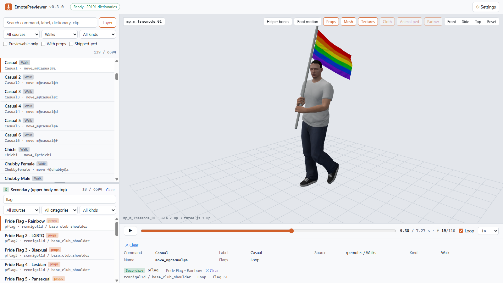

# EmotePreviewer

**Browse, search and preview thousands of FiveM emotes on your PC, played back from your own GTA V.**

English | [日本語](README.ja.md)

EmotePreviewer reads the emote definitions of [rpemotes-reborn](https://github.com/alberttheprince/rpemotes-reborn) and [scully_emotemenu](https://github.com/Scullyy/scully_emotemenu) (the older [rpemotes](https://github.com/Daudeuf/rpemotes) and [dpemotes](https://github.com/andristum/dpemotes) too), looks up each animation in your GTA V installation and plays it in a 3D viewer in your browser. No server to join, no loading screens: pick an emote from a list of six thousand and see it a second later, with its prop, on the ped of your choice, together with the other person when it is a shared emote. A single Windows executable, nothing to install.

<p align="center">
  
</p>

## Features

| | |
|---|---|
| **List and search** | Every emote of your resources in one list.<br>Instant search over command, label, dictionary and clip name.<br>Filters by resource, category, kind, "with props" and "previewable" |
| **Real playback** | Animations are decoded from the game's own `.ycd` files, not approximated.<br>Play, pause, scrub, loop, change the speed, toggle root motion |
| **Peds and textures** | Any of the 1,100 peds in the game (freemode characters, civilians, professions, story characters, animals) with their diffuse textures.<br>A stick figure when you only want the motion |
| **Props** | Umbrellas, guitars, phones, cups, signs and the rest appear on the bone the resource defines, textured.<br>Physics props and models shipped inside the resource included |
| **Shared emotes** | Hugs, handshakes, piggybacks, CPR, carrying a dog.<br>The partner's emote is looked up and both peds play at the placement the resource defines, facing each other or hanging from the other's bone.<br>Choose the partner ped in the settings |
| **Layering** | The game has whole-body emotes and upper-body emotes (waving or holding a flag while walking), and an upper-body emote plays on top of a whole-body one.<br>The viewer follows the same rule: pick a whole-body emote, open **Layer** and pick an upper-body one to see the two combined |
| **Animal emotes** | Switch to the right animal (rottweiler, pug, cat, coyote, …) automatically |
| **Walk styles** | Resolved through the game's clip set table and played as their walk cycle.<br>Scenarios and facial expressions are listed with a reason why they cannot be previewed |
| **Any clip of a dictionary** | See the other clips next to an emote's by choosing one from the dictionary, without leaving the viewer |
| **Resources from GitHub** | Fetch and update rpemotes-reborn / scully_emotemenu (or the older rpemotes / dpemotes) from the settings page.<br>Or add a local folder |
| **Made for editing a resource** | Folder resources are watched: a `.ycd` or Lua file you add or overwrite is picked up a moment later.<br>The clip on screen is swapped in place without losing the playhead.<br>A **Rescan** button does the same on demand |

<p align="center">
  
  
</p>

<p align="center">
  
  
</p>

## Requirements

- Windows 10 / 11 (x64) and a browser (Edge, Chrome, …).
- **GTA V for PC, Legacy edition** (Steam, Rockstar Games Launcher or Epic). It is the source of the animations, skeletons, meshes and textures. GTA V Enhanced is not supported. Without the game the list and search still work, but nothing plays.
- **Four key files** created from your own game with [EmotePreviewer Key Tool](https://github.com/Acc-Off/EmotePreviewerKeyTool) (see step 1 below). The archives are encrypted; EmotePreviewer contains no key material.
- The emote resources themselves. The settings page downloads rpemotes-reborn and scully_emotemenu (and the older rpemotes and dpemotes) from GitHub; a copy you already have works as a folder.

## Getting started

1. **Create the key files.** Download `EmotePreviewerKeyTool-<version>-win-x64.exe` from the [Key Tool releases](https://github.com/Acc-Off/EmotePreviewerKeyTool/releases) and double-click it. It reads the keys from your `GTA5.exe` and writes them to `%LOCALAPPDATA%\EmotePreviewer\keys`, where EmotePreviewer looks for them. This is needed once.
2. **Download EmotePreviewer.** Get `EmotePreviewer-<version>-win-x64.exe` from [Releases](https://github.com/Acc-Off/EmotePreviewer/releases) and run it. It is not code-signed, so Windows SmartScreen may ask once ("More info" → "Run anyway"). A console window opens and your browser opens `http://127.0.0.1:20300/`.
   - `…-slim.exe` is much smaller but needs the .NET 10 **Desktop Runtime** and **ASP.NET Core Runtime** (x64) from https://dotnet.microsoft.com/download/dotnet/10.0. Pick it only if you already have them.
3. **Add the resources.** Open **Settings** → **Emote resources** and click **Download** next to rpemotes-reborn and/or scully_emotemenu (about 80 MB for the rpemotes ones), or **Add folder…** for a copy on your disk. The GTA V folder is detected from the registry; the settings page shows whether the game and the key files were found.
4. **Pick an emote.** Type in the search box, click a row, and it plays. Arrow keys move through the list, Space plays and pauses, `/` jumps to the search box.

Quit with Ctrl+C in the console window or **Quit EmotePreviewer** on the settings page. Starting the exe again while it runs just opens the browser on the running instance.

### Around the viewer

| Control | Meaning |
|---|---|
| **Props** | Show the props defined for the emote |
| **Mesh** | Ped mesh on, stick figure off |
| **Textures** | Diffuse textures on props and the ped (flat colours when off) |
| **Cloth** | Parts the game moves with its cloth simulation (the protagonists' jackets). Drawn attached to the body here, without the swing; enabled only for peds that have such parts |
| **Animal ped** | Play animal emotes on their animal instead of the configured ped |
| **Partner** | Show the other ped of a shared emote |
| **Layer** (next to the search box) | Opens the lower list. The upper list then shows only whole-body emotes (primaries) and the lower one only upper-body emotes (secondaries); the upper body of the one picked below plays on top of the one picked above, so only pairs the game can play together are selectable. The lower list has its own search box and source / category / kind filters (animal emotes appear only under an emote of the same animal); drag the divider to resize. Closing it drops the secondary |
| **Esc** / **✕ Clear** in the details / clicking the selected row again | Clears the selection; a secondary left on its own plays over the walk style's idle |
| **Helper bones** | Include the helper bones (mover, prop, IK, roll and eye-target bones) in the stick figure |
| **Root motion** | Apply the clip's root motion so the ped moves; off keeps it at the origin |
| **Front / Side / Top / Reset** | Camera presets; drag to orbit, wheel to zoom |
| Timeline | Scrub, loop, speed 0.25× to 2×, frame counter |

The details panel under the timeline shows the resource's definition: command, dictionary and clip, duration, flags (loop, move, upper body and the flag value), props with their bones, for shared emotes the partner and how the two peds are placed, and the layered secondary. **Pick a clip from the dictionary** lists every clip of the emote's dictionary (a clip picked by hand always plays whole-body, which is also how to see the leg motion of an upper-body emote).

Ped and partner ped are chosen on the settings page (searchable, grouped by category). Changing the ped rebuilds the viewer without re-indexing the game.

### Why is an emote not previewable?

The list marks entries that cannot play and the details panel gives the reason:

| Reason | Meaning |
|---|---|
| Not indexed | The game data is still being indexed (about two seconds after start), or GTA V / the key files were not found |
| Kind | Scenarios and facial expressions are not animations the viewer can play |
| No dictionary / no clip | The resource refers to an animation that is not in the game data (typos, removed content, dance variants that never existed) |
| Animal | The animal ped the emote is meant for is missing from the game data |

With both default resources loaded, about 6,200 of the 6,350 entries that name an animation play (walk styles included, 260 of their 270).

### Where things are stored

`%LOCALAPPDATA%\EmotePreviewer` (shown on the settings page):

| Path | Contents |
|---|---|
| `settings.json` | Settings, saved from the UI |
| `keys\` | The four key files (default location) |
| `resources\<id>\` | Resources fetched from GitHub |
| `cache\` | Extracted skeletons; safe to delete |
| `logs\` | Rolling log |

Command-line options (`--port`, `--data-dir`, `--gta`, `--keys`, `--no-browser`, `--app`) are described in the [development guide](Docs/development.md).

## Making your own emotes

[MotionConvertToEmote](https://github.com/Acc-Off/MotionConvertToEmote) turns motion capture (BVH) and MMD motions (VMD) into `.ycd` clips for rpemotes-reborn and scully_emotemenu. Drop the clip into a resource folder EmotePreviewer watches, and it shows up in the list for checking before you put it on a server.

## How it works

The executable is a small local web server. On start it parses the Lua data files of the resources into a catalog and indexes the RPF archives of your GTA V (base game, `update.rpf` and the DLC packs in the game's own load order). When you select an emote, the clip is decoded and baked into per-bone transforms for the chosen ped's skeleton and sent to the browser, where three.js plays it. Props and the partner ped are attached to bones with the same offsets and rotation order the game uses, so what you see is what the resource does in-game.

The archive layer comes from the MIT-licensed [gta-toolkit](https://github.com/carmineos/gta-toolkit); the animation decoder, mesh and texture extraction are EmotePreviewer's own.

## Building from source

Prerequisites: [.NET 10 SDK](https://dotnet.microsoft.com/download) and Node.js 22 or later.

```
git clone https://github.com/Acc-Off/EmotePreviewer.git
cd EmotePreviewer
dotnet build EmotePreviewer.slnx -c Release     # also runs npm ci && npm run build and embeds the SPA
dotnet test  EmotePreviewer.slnx -c Release --no-build
dotnet run   -c Release --no-build --project src/EmotePreviewer.App -- --data-dir <temp folder>
```

Layout, API, developer tools and tests are described in [Docs/development.md](Docs/development.md). The design documents in [Docs/](Docs/) are in Japanese.

## Disclaimer

EmotePreviewer is an independent project. It is not affiliated with or endorsed by Rockstar Games, Take-Two Interactive, Cfx.re (FiveM) or the authors of the emote resources. It reads the game you own and the resources you provide; it contains no game assets, key material or emote data.

## License

[MIT](LICENSE). Third-party components and their licenses are listed in [THIRD-PARTY-NOTICES.md](THIRD-PARTY-NOTICES.md) and on the settings page.
